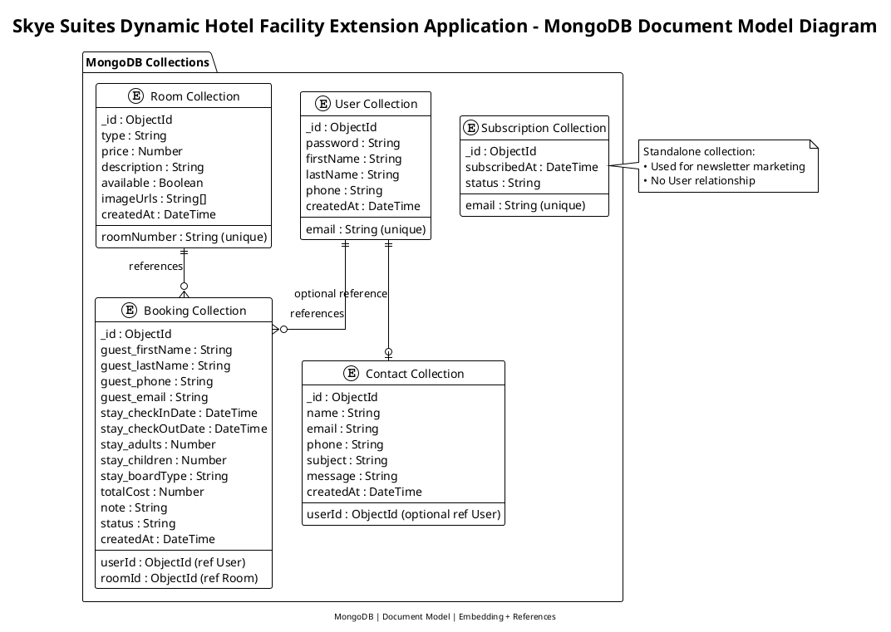

# wta-backend

## MongoDB Document Model – Table Representation

This table describes the **logical document structure** of each MongoDB collection, including **embedded fields** and **logical references**.

---

### User Collection

| Field Name  | Type            | Description                            |
| ----------- | --------------- | -------------------------------------- |
| `_id`       | ObjectId        | Unique identifier generated by MongoDB |
| `email`     | String (unique) | User login email                       |
| `password`  | String          | Hashed user password                   |
| `firstName` | String          | User first name                        |
| `lastName`  | String          | User last name                         |
| `phone`     | String          | Contact number                         |
| `createdAt` | DateTime        | Account creation timestamp             |

---

### Room Collection

| Field Name    | Type            | Description                             |
| ------------- | --------------- | --------------------------------------- |
| `_id`         | ObjectId        | Unique room identifier                  |
| `roomNumber`  | String (unique) | Hotel room number                       |
| `type`        | String          | Room type (Single, Double, Suite, etc.) |
| `price`       | Number          | Price per night                         |
| `description` | String          | Room description                        |
| `available`   | Boolean         | Availability status                     |
| `imageUrls`   | String[]        | Room images                             |
| `createdAt`   | DateTime        | Record creation date                    |

---

### Booking Collection

| Field Name          | Type                | Description                  |
| ------------------- | ------------------- | ---------------------------- |
| `_id`               | ObjectId            | Unique booking identifier    |
| `userId`            | ObjectId (ref User) | Reference to User collection |
| `roomId`            | ObjectId (ref Room) | Reference to Room collection |
| `guest_firstName`   | String              | Guest first name (snapshot)  |
| `guest_lastName`    | String              | Guest last name (snapshot)   |
| `guest_phone`       | String              | Guest phone number           |
| `guest_email`       | String              | Guest email                  |
| `stay_checkInDate`  | DateTime            | Check-in date                |
| `stay_checkOutDate` | DateTime            | Check-out date               |
| `stay_adults`       | Number              | Number of adults             |
| `stay_children`     | Number              | Number of children           |
| `stay_boardType`    | String              | Meal plan type               |
| `totalCost`         | Number              | Total booking cost           |
| `note`              | String              | Optional user note           |
| `status`            | String              | Booking status               |
| `createdAt`         | DateTime            | Booking timestamp            |

---

### Contact Collection

| Field Name  | Type                         | Description              |
| ----------- | ---------------------------- | ------------------------ |
| `_id`       | ObjectId                     | Contact message ID       |
| `userId`    | ObjectId (optional ref User) | Logged-in user reference |
| `name`      | String                       | Sender name              |
| `email`     | String                       | Sender email             |
| `phone`     | String                       | Sender phone             |
| `subject`   | String                       | Message subject          |
| `message`   | String                       | Message body             |
| `createdAt` | DateTime                     | Submission time          |

---

### Subscription Collection

| Field Name     | Type            | Description           |
| -------------- | --------------- | --------------------- |
| `_id`          | ObjectId        | Subscription ID       |
| `email`        | String (unique) | Subscriber email      |
| `subscribedAt` | DateTime        | Subscription date     |
| `status`       | String          | Active / Unsubscribed |

## MongoDB Document Model Diagram

The **MongoDB Document Model Diagram** and the accompanying **table-based schema** describe the logical data design of the hotel booking system implemented using a **document-oriented database**. Unlike traditional ERDs designed for relational systems, this visualization emphasizes **collections, documents, embedded data, and logical ObjectId references**, which more accurately reflect MongoDB’s storage model and access patterns.

The diagram illustrates five core collections: **User, Room, Booking, Contact, and Subscription**. Each collection stores related documents identified by MongoDB-generated ObjectIds. Relationships between collections are represented using **logical references** rather than enforced foreign keys, as referential integrity is managed at the application level in MongoDB.

The **Booking collection** demonstrates selective denormalization through embedded snapshot data. Guest information and stay details are stored directly within the booking document to preserve historical accuracy, reduce dependency on user profile updates, and optimize read performance for booking-related queries.

The **Contact collection** supports both authenticated and guest users by allowing the user reference to be optional, enabling flexible message handling within a single collection. The **Subscription collection** is modeled as a standalone collection, as it serves a marketing function and does not require a direct association with registered users.

The table representation complements the diagram by providing a **field-level specification** of each collection, including data types and descriptions. Embedded documents are flattened using prefixed field names for clarity while directly mapping to nested structures in the MongoDB implementation.

Together, the diagram and table provide a concise, implementation-oriented view of the database design, clearly communicating structure, relationships, and modeling decisions in a manner appropriate for a MongoDB-based NoSQL system.
